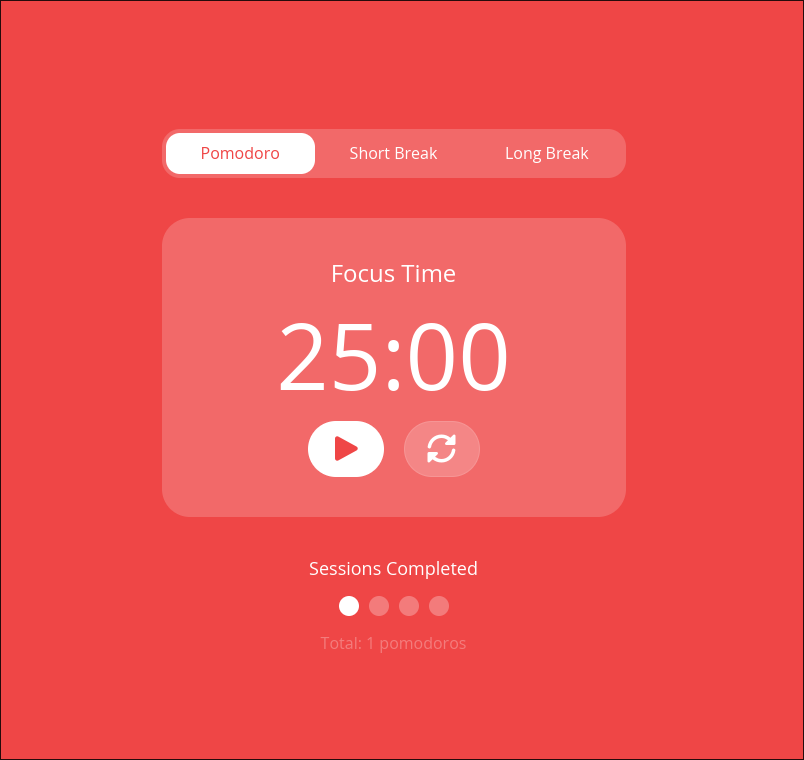
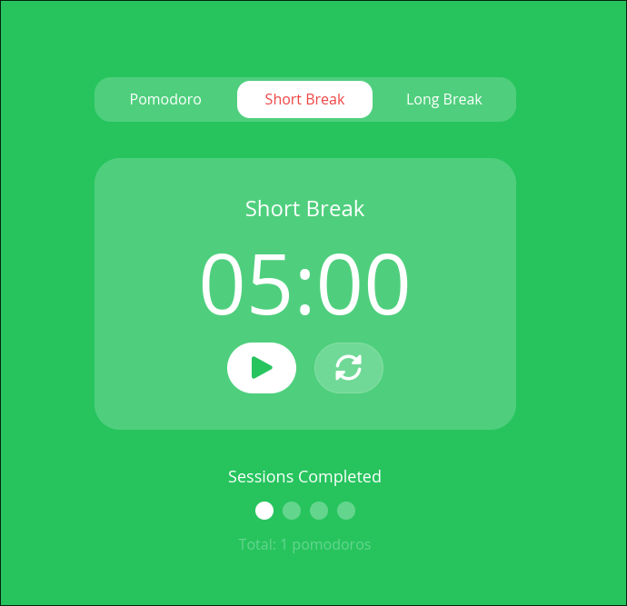
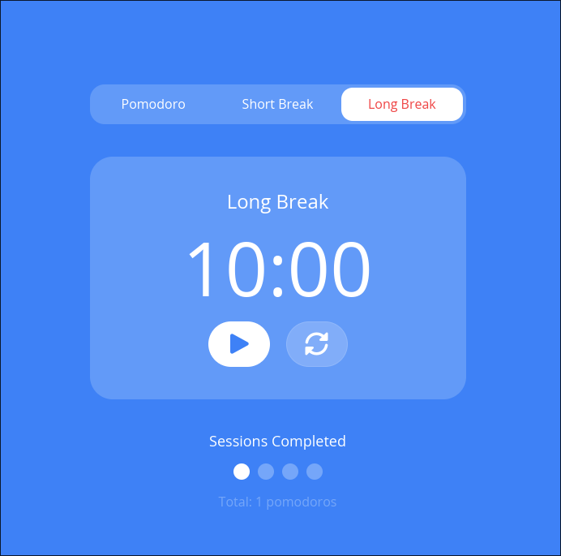

# Pomodoro

A simple Pomodoro timer desktop app built as a learning project for [iced-rs](https://github.com/iced-rs/iced), a cross-platform GUI library for Rust.

## About

This project was created to explore iced's core concepts: the Elm-like architecture (Model / Update / View), widget composition, subscriptions for tick-based timers, and custom styling.

## Features

- Three modes: Focus, Short Break, Long Break
- Click the timer to edit the duration directly
- Session counter with visual dots
- Color-coded themes per mode

## Screenshots

| Focus | Short Break | Long Break |
|-------|-------------|------------|
|  |  |  |

## Build & Run

```bash
cargo run
```

## Dependencies

- [iced](https://crates.io/crates/iced) `0.14`
- [iced_font_awesome](https://crates.io/crates/iced_font_awesome) `0.4`
